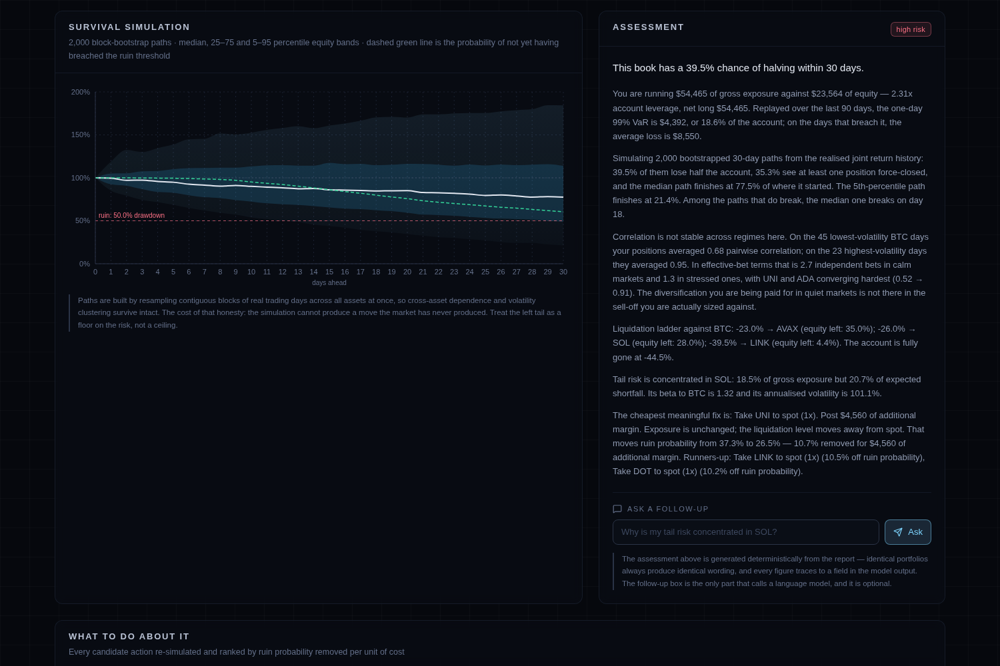
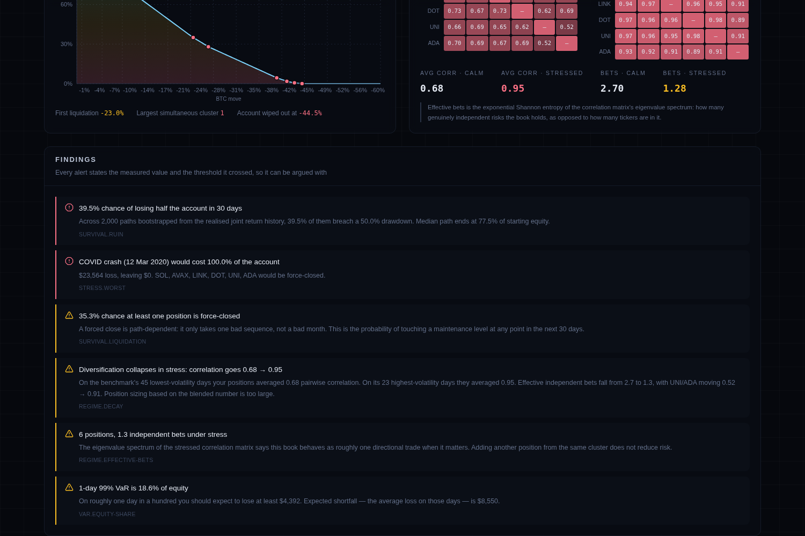
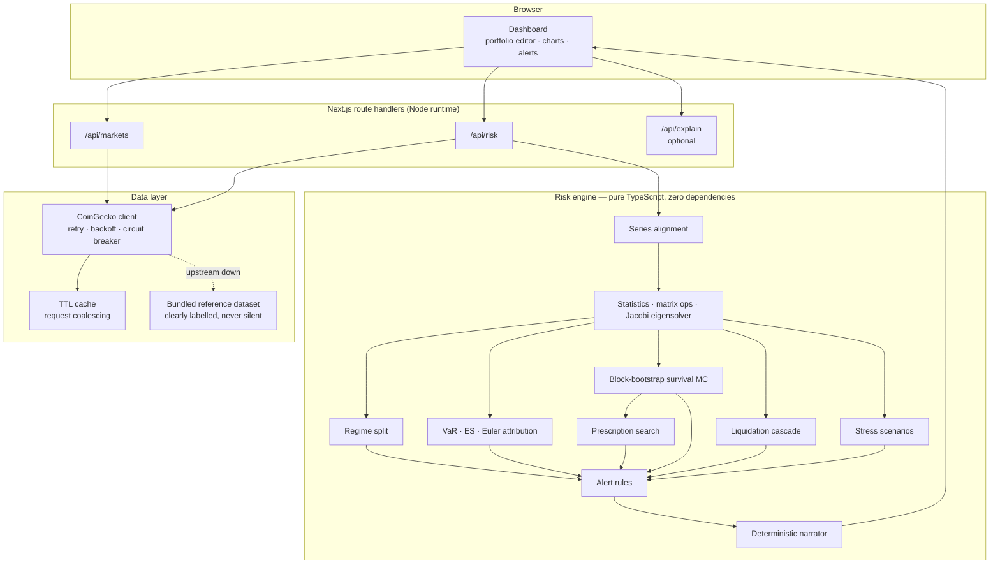

# Sentinel

**Survival analysis for leveraged crypto portfolios.**

Leveraged books rarely die because one position moved. They die because six positions that looked independent moved together and hit their maintenance levels inside the same hour.

Every consumer crypto portfolio tool answers *"what is my portfolio worth?"*. Sentinel answers a different and much more useful question: **"what is the probability this account still exists in 30 days, and what is the cheapest single trade that improves it?"**



---

## The thesis

Retail leveraged traders hold six assets and believe they hold six bets. They don't. In a drawdown, alt correlations converge toward 1, betas compress upward, and positions that each looked survivable in isolation breach maintenance margin simultaneously. The tooling available to them actively hides this:

| What existing tools show | Why it misleads |
|---|---|
| Allocation pie chart | Says nothing about how the slices co-move |
| Per-position liquidation price | Computed one position at a time; never shows the cluster |
| A single blended correlation matrix | An average of two very different regimes |
| Portfolio volatility | Understates books whose risk lives in a few specific days |
| "You are over-exposed" | True, useless — offers no ranked way to fix it |

Sentinel measures the failure mode directly and then prescribes against it.

---

## What it actually computes

### 1. Regime-split correlation

Correlation is measured **separately** in a calm regime and a stressed regime, and the gap between them (the *diversification decay*) is reported as a headline number.

The obvious implementation — take the benchmark's worst N days and measure correlation there — **is wrong**, and wrong in the direction that would make this tool understate its own central claim. Conditioning on one tail of the factor truncates the factor's variance within the subsample, which mechanically shrinks the systematic share of each asset's variance and biases measured correlation *downward*. This is the Boyer et al. / Loretan–English critique of conditional correlation. A naive implementation reports that diversification **improves** in a crash.



Sentinel instead defines regimes by the benchmark's **rolling realised volatility**: days in the top quartile of trailing 7-day volatility form the stressed regime, days in the bottom half form the calm regime, and the band between is deliberately left out so the two samples stay distinct. Volatility regimes are two-sided, so they do not truncate the factor distribution — and they correspond to what actually causes simultaneous liquidation, which is sustained high-volatility periods rather than one bad print.

### 2. Effective number of independent bets

The exponential Shannon entropy of the correlation matrix's normalised eigenvalue spectrum:

```
p_k    = λ_k / Σλ
N_eff  = exp( −Σ p_k · ln p_k )
```

Counting positions tells you how many tickers you own. This tells you how many genuinely distinct risks you own. A typical "diversified" six-asset alt book scores around 2.7 in calm markets and **collapses below 1.3** under stress — which is the honest explanation for why it behaves like a single levered directional trade in a sell-off.

Eigenvalues come from a cyclic Jacobi rotation solver (`src/lib/risk/matrix.ts`) — O(n³) per sweep and overkill at this size, but numerically bulletproof for symmetric input, which matters more than speed here.

### 3. Block-bootstrap survival simulation

The headline output. Thousands of forward paths, each walked day by day with full position-level liquidation logic, producing:

- probability of losing a chosen fraction of the account within the horizon
- probability at least one position is force-closed
- probability the entire book is force-closed
- median days-to-ruin among paths that break
- the full percentile fan of account equity over time

Paths are generated by **stationary block bootstrap** (Politis & Romano), resampling contiguous blocks of real trading days across *all assets at once*. Block lengths are geometric with mean 5.

Why this rather than a Gaussian / Cholesky simulation:

1. Resampling whole days preserves the joint dependence structure exactly as it was realised, **including tail dependence** — which a correlation matrix throws away by construction.
2. Contiguous blocks preserve volatility clustering. Crypto drawdowns are consecutive bad days, and it is the *consecutive* part that liquidates accounts.
3. It cannot produce a return the market has never produced, which keeps the output defensible.

The honest cost of (3): it cannot produce genuinely unprecedented moves either. The left tail is a **floor** on the risk, not a ceiling. The UI says so, next to the chart.

The simulation is seeded from a hash of the portfolio, so identical input always produces identical output — a risk number that jitters between refreshes is a risk number nobody trusts.

### 4. Liquidation cascade map

The benchmark is walked down in 0.5% steps to −60%. At each rung every asset moves by **its own beta**, not by the same percentage, because that is how a sell-off actually propagates — high-beta alts reach their liquidation levels first even at identical nominal leverage.

The output is the chart that makes the risk legible: not *"your liquidation price is $X"* per position, but *"at −18% you lose two positions at once, and the margin that frees up is not enough to hold the rest."*

### 5. Expected shortfall attribution

ES is coherent and homogeneous of degree 1 in position size, so it decomposes **exactly** across positions by Euler's theorem:

```
ES = Σ_i notional_i · ( −E[ r_i | portfolio in tail ] )
```

Each asset is charged with how it behaved specifically on the days the whole book was bleeding — not with how volatile it is in isolation. The UI plots share-of-exposure against share-of-tail-loss, and the gap between the two bars is the actionable number. (Verified in the test suite: the components sum to the total ES.)

### 6. Ranked de-risking prescription

The part that makes it worth opening twice.

Sentinel enumerates realistic actions — trim 25/50/100%, halve leverage, take to spot — **re-simulates the entire portfolio under each one**, and ranks them by:

```
efficiency = Δ(ruin probability) / (cost as a fraction of exposure or equity)
```

Ranking by raw reduction is useless because closing everything always wins. Ranking by efficiency finds the *cheapest* fix. Every candidate is evaluated against the same bootstrap draws as the baseline, so the differences reflect the action rather than simulation noise.

The shortlist is then filtered for variety — at most one action per position, and a cap on repeats of any single action kind — because a list showing "take X to spot" five times with different tickers isn't offering a choice.

### 7. Three VaR estimators, shown together

Historical simulation, variance-covariance, and Cornish-Fisher (corrected for skew and excess kurtosis), reported side by side **on purpose**. When the historical figure sits well above the normal-distribution one, the portfolio's risk lives in a handful of specific days rather than in day-to-day volatility, and any model that only knows about volatility will under-size it. That gap is itself an alert rule.

### 8. Liquidation touch probability

Distance-to-liquidation is the wrong number: being briefly wrong is enough to be closed out. Sentinel reports the probability of **touching** the barrier at any point in the horizon, via the reflection principle for driftless GBM:

```
P( min_{t≤T} S_t ≤ B ) = 2 · Φ( ln(B/S) / (σ√T) )
```

---

## Architecture



**Every quantitative operation runs server-side.** That is deliberate: the simulation is a few million floating-point operations, any upstream API key must never reach the browser, and keeping the engine behind one endpoint means the numbers in the UI and the numbers a future API client would get are produced by the same code path.

**The risk engine has zero runtime dependencies.** No `mathjs`, no `simple-statistics`. Every estimator — Acklam's inverse normal CDF, Cornish-Fisher, Jacobi eigenvalues, Cholesky with shrinkage fallback, the stationary bootstrap — is implemented and unit-tested against known answers in `src/lib/risk/`. That was a choice about being able to defend every number, not about avoiding `npm install`.

### Project layout

```
src/
  app/
    page.tsx                  dashboard orchestration
    api/markets/route.ts      cached market snapshot
    api/risk/route.ts         the single compute endpoint
    api/explain/route.ts      optional conversational layer
  components/
    charts.tsx                survival fan · cascade · attribution · heatmaps
    panels.tsx                alerts · prescription · stress · narrative
    PositionEditor.tsx        portfolio table with presets
    ui.tsx                    primitives
  lib/
    risk/
      stats.ts                mean/var/quantile/skew/kurtosis, normal CDF + inverse
      matrix.ts               covariance, correlation, Jacobi eigenvalues, Cholesky
      returns.ts              series alignment, portfolio P&L
      var.ts                  three VaR estimators, Euler ES attribution
      regime.ts               volatility-regime correlation split, effective bets
      survival.ts             stationary block bootstrap Monte Carlo
      cascade.ts              liquidation ladder and cluster detection
      stress.ts               named historical scenarios, beta-propagated
      performance.ts          drawdown, Sharpe/Sortino, touch probability
      prescribe.ts            candidate search and efficiency ranking
      alerts.ts               threshold rules with stated values
      narrate.ts              deterministic risk narrator
      engine.ts               orchestration
    market/
      coingecko.ts            live client with circuit breaker
      cache.ts                TTL cache with request coalescing
      fallback.ts             labelled synthetic reference dataset
tests/
  stats.test.ts               known-answer tests for every estimator
  engine.test.ts              invariants, monotonicity, end-to-end
```

---

## Engineering decisions worth calling out

**Series alignment happens before anything else.** Upstream returns slightly different timestamps per asset — different listing dates, occasional gaps. Computing a covariance matrix across misaligned series silently produces garbage, and it is the classic bug in home-made risk tools. `alignSeries` intersects on calendar day, forward-fills at most one missing day, and *drops and reports* any asset with under 80% coverage rather than quietly corrupting the matrix.

**Degenerate input returns zero, never NaN.** Every statistics primitive is total. A half-filled portfolio produces a boring report, not `NaN%` in the UI.

**Cholesky has a shrinkage fallback.** Sample correlation matrices from short windows are frequently not positive definite. Rather than throwing, the decomposition progressively shrinks toward the identity until it succeeds, and reports the shrinkage factor.

**The circuit breaker exists because of a real failure mode.** Without it, an upstream outage costs *every* request the full retry-and-backoff budget before falling back — so the page gets slower precisely when the data is worst. Measured: 4.6s cold with upstream failing, 316ms once the breaker opens.

**The narrator is deterministic, not an LLM.** A risk explanation that changes wording between two identical portfolios is a liability. The written assessment is generated from the report by code, and every figure in it traces to a field in the model output. The optional Claude endpoint adds *follow-up questions* on top; it never replaces the assessment, and the app is fully functional without an API key.

**The fallback dataset is labelled everywhere it appears.** When the live feed is unreachable the app still works, but a banner, a badge, and a field in the API response all say the prices are not current. A risk tool that silently shows stale numbers is worse than one that shows none.

---

## Running it

```bash
npm install
npm run dev          # http://localhost:3000
```

```bash
npm test             # 49 tests
npm run typecheck
npm run build
```

No environment variables are required. Two are optional:

| Variable | Effect if absent |
|---|---|
| `COINGECKO_API_KEY` | Free tier is used; rate limits are handled by cache + breaker + fallback |
| `ANTHROPIC_API_KEY` | Follow-up question box returns a clear "not configured" message; everything else works |

Copy `.env.example` to `.env.local` to set them.

---

## Deploying

Push to GitHub, then import the repository at [vercel.com/new](https://vercel.com/new). Framework detection, build command, and output directory are all automatic — no configuration needed. Add the optional environment variables under **Settings → Environment Variables** if you want them.

---

## What this model cannot see

Stated here as prominently as in the UI, because a risk tool that oversells its own coverage is worse than no risk tool.

Sentinel is built on daily closes and a bootstrap of those same days. It has **no view** on:

- venue insolvency or counterparty failure
- stablecoin depegs and oracle failure
- funding costs and fee drag
- slippage and liquidity gaps during a cascade — real liquidations are worse than modelled
- any move larger than the largest one in its sample
- **intraday** liquidation risk, which is understated because the model steps one day at a time

Cross-margin accounts are modelled as isolated margin, which is the conservative direction for cascade analysis but not what every venue actually does.

Treat every number as a lower bound on how bad things can get, and as a tool for **comparing portfolios against each other** rather than as a forecast.

Nothing here is investment advice.

---

## Licence

MIT.
