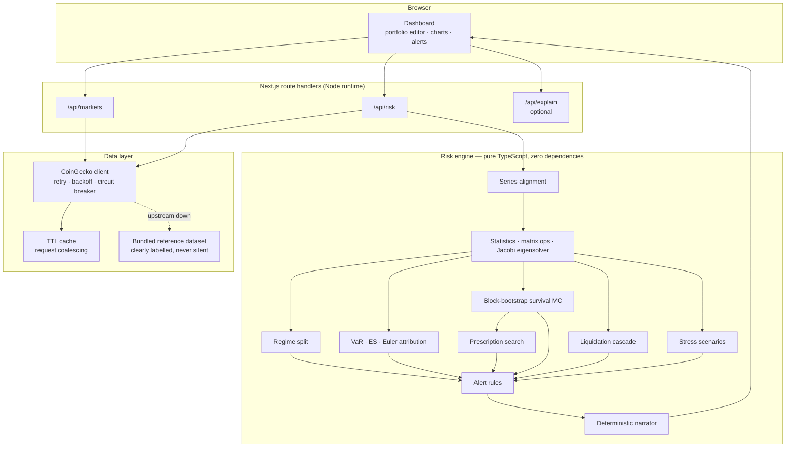

# Sentinel

**Survival analysis for leveraged crypto portfolios.**

Leveraged books rarely die because one position moved. They die because six positions that looked independent moved together and hit their maintenance levels inside the same hour.

Every consumer crypto portfolio tool answers *"what is my portfolio worth?"*. Sentinel answers a different and much more useful question: **"what is the probability this account still exists in 30 days, and what is the cheapest single trade that improves it?"**

And then it does the thing almost no risk tool does: it [marks its own homework](#9-does-the-model-actually-work) out of sample, and shows you the score even when the score is bad.


---

## The thesis

Retail leveraged traders hold six assets and believe they hold six bets. They don't. In a drawdown, alt correlations converge toward 1, betas compress upward, and positions that each looked survivable in isolation breach maintenance margin simultaneously. The tooling available to them actively hides this:

| What existing tools show | Why it misleads |
|---|---|
| Allocation pie chart | Says nothing about how the slices co-move |
| Per-position liquidation price | Computed one position at a time; never shows the cluster |
| A single blended correlation matrix | An average of two very different regimes |
| Portfolio volatility | Understates books whose risk lives in a few specific days |
| "You are over-exposed" | True, useless — offers no ranked way to fix it |

Sentinel measures the failure mode directly and then prescribes against it.

---

## What it actually computes

### 1. Regime-split correlation

Correlation is measured **separately** in a calm regime and a stressed regime, and the gap between them (the *diversification decay*) is reported as a headline number.

The obvious implementation — take the benchmark's worst N days and measure correlation there — **is wrong**, and wrong in the direction that would make this tool understate its own central claim. Conditioning on one tail of the factor truncates the factor's variance within the subsample, which mechanically shrinks the systematic share of each asset's variance and biases measured correlation *downward*. This is the Boyer et al. / Loretan–English critique of conditional correlation. A naive implementation reports that diversification **improves** in a crash.


Sentinel instead defines regimes by the benchmark's **rolling realised volatility**: days in the top quartile of trailing 7-day volatility form the stressed regime, days in the bottom half form the calm regime, and the band between is deliberately left out so the two samples stay distinct. Volatility regimes are two-sided, so they do not truncate the factor distribution — and they correspond to what actually causes simultaneous liquidation, which is sustained high-volatility periods rather than one bad print.

### 2. Effective number of independent bets

The exponential Shannon entropy of the correlation matrix's normalised eigenvalue spectrum:

```
p_k    = λ_k / Σλ
N_eff  = exp( −Σ p_k · ln p_k )
```

Counting positions tells you how many tickers you own. This tells you how many genuinely distinct risks you own. A typical "diversified" six-asset alt book scores around 2.7 in calm markets and **collapses below 1.3** under stress — which is the honest explanation for why it behaves like a single levered directional trade in a sell-off.

Eigenvalues come from a cyclic Jacobi rotation solver (`src/lib/risk/matrix.ts`) — O(n³) per sweep and overkill at this size, but numerically bulletproof for symmetric input, which matters more than speed here.

### 3. Block-bootstrap survival simulation

The headline output. Thousands of forward paths, each walked day by day with full position-level liquidation logic, producing:

- probability of losing a chosen fraction of the account within the horizon
- probability at least one position is force-closed
- probability the entire book is force-closed
- median days-to-ruin among paths that break
- the full percentile fan of account equity over time

Paths are generated by **stationary block bootstrap** (Politis & Romano), resampling contiguous blocks of real trading days across *all assets at once*. Block lengths are geometric with mean 5.

Why this rather than a Gaussian / Cholesky simulation:

1. Resampling whole days preserves the joint dependence structure exactly as it was realised, **including tail dependence** — which a correlation matrix throws away by construction.
2. Contiguous blocks preserve volatility clustering. Crypto drawdowns are consecutive bad days, and it is the *consecutive* part that liquidates accounts.
3. It cannot produce a return the market has never produced, which keeps the output defensible.

The honest cost of (3): it cannot produce genuinely unprecedented moves either. The left tail is a **floor** on the risk, not a ceiling. The UI says so, next to the chart.

The simulation is seeded from a hash of the portfolio, so identical input always produces identical output — a risk number that jitters between refreshes is a risk number nobody trusts.

### 4. Liquidation cascade map

The benchmark is walked down in 0.5% steps to −60%. At each rung every asset moves by **its own beta**, not by the same percentage, because that is how a sell-off actually propagates — high-beta alts reach their liquidation levels first even at identical nominal leverage.

The output is the chart that makes the risk legible: not *"your liquidation price is $X"* per position, but *"at −18% you lose two positions at once, and the margin that frees up is not enough to hold the rest."*

### 5. Expected shortfall attribution

ES is coherent and homogeneous of degree 1 in position size, so it decomposes **exactly** across positions by Euler's theorem:

```
ES = Σ_i notional_i · ( −E[ r_i | portfolio in tail ] )
```

Each asset is charged with how it behaved specifically on the days the whole book was bleeding — not with how volatile it is in isolation. The UI plots share-of-exposure against share-of-tail-loss, and the gap between the two bars is the actionable number. (Verified in the test suite: the components sum to the total ES.)

### 6. Ranked de-risking prescription

The part that makes it worth opening twice.

Sentinel enumerates realistic actions — trim 25/50/100%, halve leverage, take to spot — **re-simulates the entire portfolio under each one**, and ranks them by:

```
efficiency = Δ(ruin probability) / (cost as a fraction of exposure or equity)
```

Ranking by raw reduction is useless because closing everything always wins. Ranking by efficiency finds the *cheapest* fix. Every candidate is evaluated against the same bootstrap draws as the baseline, so the differences reflect the action rather than simulation noise.

The shortlist is then filtered for variety — at most one action per position, and a cap on repeats of any single action kind — because a list showing "take X to spot" five times with different tickers isn't offering a choice.

### 7. Three VaR estimators, shown together

Historical simulation, variance-covariance, and Cornish-Fisher (corrected for skew and excess kurtosis), reported side by side **on purpose**. When the historical figure sits well above the normal-distribution one, the portfolio's risk lives in a handful of specific days rather than in day-to-day volatility, and any model that only knows about volatility will under-size it. That gap is itself an alert rule.

### 8. Liquidation touch probability

Distance-to-liquidation is the wrong number: being briefly wrong is enough to be closed out. Sentinel reports the probability of **touching** the barrier at any point in the horizon, via the reflection principle for driftless GBM:

```
P( min_{t≤T} S_t ≤ B ) = 2 · Φ( ln(B/S) / (σ√T) )
```

### 9. Does the model actually work?

The other eight sections are the model talking. This one is the model being marked.

A risk tool that has never been backtested is a risk tool that has never been contradicted, and most of them never are — they ship a number and move on. Sentinel runs two independent out-of-sample checks, on demand, from `/api/backtest`. Every forecast is produced from data ending strictly before the outcome it is scored against.

**VaR exception testing.** The history is walked one day at a time. At each day, all three VaR estimators are re-fitted on a rolling 120-day window ending the day before, and the forecast is compared with what actually happened. The exception sequence is then put through the standard battery:

| Test | Asks | Distribution |
|---|---|---|
| Kupiec (1995) proportion-of-failures | Is the *number* of exceptions right? | χ²(1) |
| Christoffersen (1998) independence | Are exceptions *clustered*? | χ²(1) |
| Conditional coverage | Both jointly | χ²(2) |

Both χ² tails have closed forms at these degrees of freedom — `P(X>x) = 2(1-Φ(√x))` for df 1, `exp(-x/2)` for df 2 — so there is no special-function library in the path here either. The p-values are verified against published critical tables in `tests/backtest.test.ts`.

The independence test is the one that earns its place. Kupiec cannot tell the difference between ten exceptions spread evenly across a year and ten on ten consecutive days; the first is a working model, the second is an account that no longer exists. Christoffersen separates them — on a deliberately clustered sequence the statistic is 137 against 2.0 for an evenly spread one.

Running this produced a finding I did not expect and have not smoothed over: **the 99% variance-covariance estimator fails on every leveraged preset**, with realised exception rates around 3% against 1% expected, while Cornish-Fisher passes. That is the fat-tail argument for the Cornish-Fisher correction stated as a measurement rather than as a footnote — and it means the normal-distribution VaR number in the UI is there to be compared against, not to be sized off.

**Survival calibration.** The headline ruin probability is scored directly. At each walk-forward origin the simulation is run on the training window alone, and the realised path over the following horizon is replayed with identical liquidation accounting to see whether the account really did breach the threshold. The pairs are scored with a Brier score, a Brier skill score against the sample base rate, and a reliability curve.

Two things are reported rather than hidden:

- **Overlapping horizons.** Origins three days apart share most of their outcome window, so the outcomes are heavily autocorrelated and the origin count massively overstates the evidence. The panel reports an *effective sample size* — the number of non-overlapping horizons — and it is usually an order of magnitude smaller. On a two-year sample it is about twenty.
- **The asymmetry.** A model that looks well calibrated on a sample this size is not proven correct; there is not enough independent evidence for that. A model that looks badly calibrated **is** proven wrong. That asymmetry is the entire reason the panel exists, and it is why the number worth reading is the direction of the bias, not the third decimal.

---

## Where the numbers come from

Three tiers of price data, tried in order, and the difference is visible on every surface that uses them:

| Tier | What it is | How it is labelled |
|---|---|---|
| 1. Live | CoinGecko, cached and circuit-broken | normal |
| 2. Committed dataset | Real daily closes in `src/data/reference-history.json` | "real closes, not current ones" |
| 3. Synthetic | The deterministic generator in `fallback.ts` | "SYNTHETIC — structure is realistic, prices are not real" |

Tier 2 ships empty and is populated by one command:

```bash
npm run fetch:history          # writes ~2400 daily closes per asset back to 2020
```

Committing that file is what turns two claims from approximations into measurements:

- Every **historical stress scenario** whose calendar window the data covers flips from `assumed` — a hand-specified benchmark shock propagated to each asset by its beta — to `measured`, the per-asset return that actually occurred, with no beta model in the path at all. The badge in the stress table says which one you are looking at, always. A window is only used if **every held asset** is covered; a scenario that mixed a real BTC move with a modelled SOL one would be the worst of both.
- The **validation battery** gets years of runway instead of months, which is the difference between detecting gross miscalibration and measuring calibration.

Tier 2 is deliberately a committed file rather than a runtime fetch. A stress scenario that silently changes because an upstream API backfilled a candle is not a stress scenario, it is a rumour.

---

## Architecture



**Every quantitative operation runs server-side.** That is deliberate: the simulation is a few million floating-point operations, any upstream API key must never reach the browser, and keeping the engine behind one endpoint means the numbers in the UI and the numbers a future API client would get are produced by the same code path.

**The risk engine has zero runtime dependencies.** No `mathjs`, no `simple-statistics`. Every estimator — Acklam's inverse normal CDF, Cornish-Fisher, Jacobi eigenvalues, Cholesky with shrinkage fallback, the stationary bootstrap — is implemented and unit-tested against known answers in `src/lib/risk/`. That was a choice about being able to defend every number, not about avoiding `npm install`.

### Project layout

```
src/
  app/
    page.tsx                  dashboard orchestration
    api/markets/route.ts      cached market snapshot
    api/risk/route.ts         the single compute endpoint
    api/backtest/route.ts     out-of-sample validation
    api/explain/route.ts      optional conversational layer
  components/
    charts.tsx                survival fan · cascade · attribution · heatmaps
    panels.tsx                alerts · prescription · stress · narrative
    ValidationPanel.tsx       backtest results and reliability curve
    PositionEditor.tsx        portfolio table with presets
    ui.tsx                    primitives
  lib/
    risk/
      stats.ts                mean/var/quantile/skew/kurtosis, normal CDF + inverse
      matrix.ts               covariance, correlation, Jacobi eigenvalues, Cholesky
      returns.ts              series alignment, portfolio P&L
      var.ts                  three VaR estimators, Euler ES attribution
      regime.ts               volatility-regime correlation split, effective bets
      survival.ts             stationary block bootstrap Monte Carlo
      cascade.ts              liquidation ladder and cluster detection
      stress.ts               named historical scenarios, beta-propagated
      performance.ts          drawdown, Sharpe/Sortino, touch probability
      prescribe.ts            candidate search and efficiency ranking
      alerts.ts               threshold rules with stated values
      narrate.ts              deterministic risk narrator
      backtest.ts             Kupiec · Christoffersen · walk-forward calibration
      engine.ts               orchestration
    market/
      coingecko.ts            live client with circuit breaker
      cache.ts                TTL cache with request coalescing
      dataset.ts              committed real-close dataset loader
      fallback.ts             labelled synthetic reference dataset
  data/
    reference-history.json    committed daily closes (npm run fetch:history)
scripts/
  fetch-history.mjs           populates the dataset above
tests/
  stats.test.ts               known-answer tests for every estimator
  engine.test.ts              invariants, monotonicity, end-to-end
  backtest.test.ts            statistical tests vs published critical values
  performance.test.ts         drawdown regressions, scenario provenance
```

---

## Engineering decisions worth calling out

**Two bugs in the drawdown back-cast, both of which produced impossible numbers.** The first version walked equity as `equity += Σ notional_i · r_i,t` with notionals fixed at today's values. Holding *dollar* exposure constant while equity falls is not a passive book — it is a strategy that re-levers into every drawdown, and it drove an **unlevered spot portfolio to zero**, which cannot happen. A real book holds constant *quantity* and lets exposure shrink with price. Separately, with no floor at zero a levered book reported a drawdown of **−335%**; an account whose equity reaches zero has been closed by the venue, and everything after that is a simulation of trading with money that no longer exists. The curve is now compounded, position-by-position, with the same liquidation accounting the Monte Carlo uses, and it is absorbing at zero. Drawdown is bounded to [−1, 0] by construction, and `tests/performance.test.ts` asserts that an unlevered book can never be ruined.

(Constant-notional P&L is still exactly right for **VaR**, which is a single-period measure where P&L is linear in returns. It is only wrong when compounded — which is why the two now live in different functions.)

**Sortino divides by the right N.** Target downside deviation is `sqrt( (1/N) Σ min(r_t,0)² )`: the sum runs over losing days, the average over *all* observations. Dividing by the count of losing days instead — the easy mistake, and what this did — inflates the denominator and silently reports a worse ratio than the definition gives.

**Series alignment happens before anything else.** Upstream returns slightly different timestamps per asset — different listing dates, occasional gaps. Computing a covariance matrix across misaligned series silently produces garbage, and it is the classic bug in home-made risk tools. `alignSeries` intersects on calendar day, forward-fills at most one missing day, and *drops and reports* any asset with under 80% coverage rather than quietly corrupting the matrix.

**Degenerate input returns zero, never NaN.** Every statistics primitive is total. A half-filled portfolio produces a boring report, not `NaN%` in the UI.

**Cholesky has a shrinkage fallback.** Sample correlation matrices from short windows are frequently not positive definite. Rather than throwing, the decomposition progressively shrinks toward the identity until it succeeds, and reports the shrinkage factor.

**The circuit breaker exists because of a real failure mode.** Without it, an upstream outage costs *every* request the full retry-and-backoff budget before falling back — so the page gets slower precisely when the data is worst. Measured: 4.6s cold with upstream failing, 316ms once the breaker opens.

**The narrator is deterministic, not an LLM.** A risk explanation that changes wording between two identical portfolios is a liability. The written assessment is generated from the report by code, and every figure in it traces to a field in the model output. The optional Claude endpoint adds *follow-up questions* on top; it never replaces the assessment, and the app is fully functional without an API key.

**The fallback dataset is labelled everywhere it appears.** When the live feed is unreachable the app still works, but a banner, a badge, and a field in the API response all say the prices are not current. A risk tool that silently shows stale numbers is worse than one that shows none.

---

## Running it

```bash
npm install
npm run dev          # http://localhost:3000
```

```bash
npm test             # 93 tests
npm run typecheck
npm run build
```

No environment variables are required. Two are optional:

| Variable | Effect if absent |
|---|---|
| `COINGECKO_API_KEY` | Free tier is used; rate limits are handled by cache + breaker + fallback |
| `ANTHROPIC_API_KEY` | Follow-up question box returns a clear "not configured" message; everything else works |

Copy `.env.example` to `.env.local` to set them.

---

## Deploying

Push to GitHub, then import the repository at [vercel.com/new](https://vercel.com/new). Framework detection, build command, and output directory are all automatic — no configuration needed. Add the optional environment variables under **Settings → Environment Variables** if you want them.

---

## What this model cannot see

Stated here as prominently as in the UI, because a risk tool that oversells its own coverage is worse than no risk tool.

Sentinel is built on daily closes and a bootstrap of those same days. It has **no view** on:

- venue insolvency or counterparty failure
- stablecoin depegs and oracle failure
- funding costs and fee drag
- slippage and liquidity gaps during a cascade — real liquidations are worse than modelled
- any move larger than the largest one in its sample
- **intraday** liquidation risk, which is understated because the model steps one day at a time

Cross-margin accounts are modelled as isolated margin, which is the conservative direction for cascade analysis but not what every venue actually does.

Any stress scenario still badged `assumed` is a beta-propagated approximation rather than a measurement — `npm run fetch:history` is what fixes that, and the badge is what tells you whether it has been run.

Treat every number as a lower bound on how bad things can get, and as a tool for **comparing portfolios against each other** rather than as a forecast.

Nothing here is investment advice.

---

## Licence

MIT.
