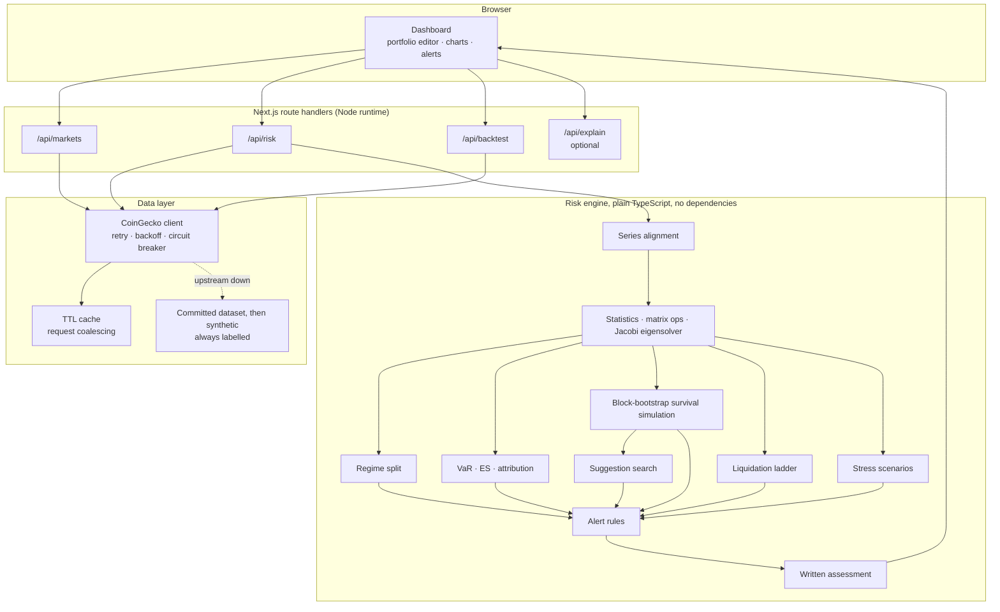

# Sentinel

[](https://github.com/Abdul-jaybar/sentinel/actions/workflows/ci.yml)

A risk tool for leveraged crypto portfolios. You enter your positions, and it tells you how likely the account is to survive the next 30 days, which positions would get liquidated together, and which single trade would cut that risk the most for the least cost.

It also backtests itself on real price history and shows you the results, including where the model does badly.


## Why I built it

Most portfolio trackers tell you what your holdings are worth. If you trade with leverage, that isn't the question that matters. The question is whether the account will still be open next month.

Leveraged accounts usually don't blow up because one coin fell. They blow up because several coins that normally move somewhat independently all fell together, and every position hit its liquidation level on the same day. Six alt positions can look like six separate bets in a calm market and behave like one big bet in a crash.

The usual tools hide this:

| What most tools show | What it misses |
|---|---|
| An allocation pie chart | Nothing about whether the slices move together |
| A liquidation price per position | Each one is calculated alone, so you never see several hitting at once |
| One correlation matrix | Averages calm and stressed markets, which behave very differently |
| Portfolio volatility | Understates risk that is concentrated in a few bad days |
| "You are over-exposed" | Doesn't tell you what to do about it |

Sentinel measures that failure mode directly and then suggests fixes.

## What it calculates

### 1. Correlation in calm vs. stressed markets

Correlation is measured separately for calm days and stressed days, and the difference is shown as a headline number. This is the "diversification disappears when you need it" effect, measured on your actual positions.

The obvious way to do this (take BTC's worst days and measure correlation on those) gives the wrong answer. Picking days by how far BTC fell squeezes the range of BTC's moves in that sample, which makes correlations look *lower* than they really are. That approach would report that diversification gets better in a crash. (This is a known problem in the literature, see Boyer et al. and Loretan and English.)


Sentinel splits days by BTC's recent volatility instead. Days in the top quarter of 7-day volatility count as stressed, days in the bottom half count as calm, and the days in between are left out so the two groups stay clearly separate. High-volatility stretches are also what actually causes positions to be liquidated together.

### 2. How many independent bets you really have

Owning six coins doesn't mean you have six independent bets. Sentinel estimates the real number from the eigenvalues of the correlation matrix:

```
p_k    = λ_k / Σλ
N_eff  = exp( −Σ p_k · ln p_k )
```

A typical six-coin alt portfolio scores around 2.7 in calm markets and drops below 1.3 in stressed ones. In other words, in a sell-off it acts like one leveraged bet on the market.

The eigenvalues come from a Jacobi solver written from scratch in `src/lib/risk/matrix.ts`. It is slower than it needs to be for large matrices, but it is very stable, and portfolios here only have a handful of assets.

### 3. Survival simulation

This is the main output. Sentinel simulates thousands of possible next 30 days, day by day, and applies the liquidation rules to every position along the way. From that it reports:

- the chance of losing a chosen share of the account
- the chance at least one position gets liquidated
- the chance the whole account gets liquidated
- the median number of days until that happens, on the paths where it does
- a fan chart of how the account balance could evolve

The paths are built by resampling real historical days in chunks (a stationary block bootstrap, Politis and Romano), with all coins taken from the same days. Chunks average 5 days long.

I chose this over the usual approach of drawing random returns from a normal distribution because:

1. Using real days keeps the way the coins actually moved together, including in the extremes. A correlation matrix loses that.
2. Using chunks of consecutive days keeps losing streaks intact. Accounts get liquidated by several bad days in a row, not by one.
3. It never invents a move that hasn't happened.

The downside of point 3 is that it can't produce a crash bigger than the worst one in the data. So the risk it reports is a minimum, not a maximum, and the UI says so next to the chart.

The random seed comes from the portfolio itself, so the same portfolio always gives the same numbers. A risk number that changes every time you refresh is hard to trust.

### 4. Liquidation ladder

This walks BTC down in 0.5% steps to −60%. At each step, every coin moves by its own beta to BTC rather than by the same amount, because high-beta alts fall further in a sell-off. That means they hit liquidation first, even at the same leverage.

Instead of "your liquidation price is $X" for each position, you get something like "at −18%, two positions get liquidated at once, and the margin that frees up isn't enough to save the rest."

### 5. Which positions cause the losses

Expected shortfall (the average loss on the worst days) is split exactly across positions:

```
ES = Σ_i notional_i · ( −E[ r_i | portfolio in tail ] )
```

Each position is charged for how it behaved on the days the whole portfolio was losing, not for how volatile it is on its own. The UI shows each position's share of exposure next to its share of tail losses, and the gap between the two is what you should look at. The test suite checks that the parts add up to the total.

### 6. Ranked suggestions

Sentinel tries a set of realistic changes (trim a position by 25%, 50% or 100%, halve its leverage, or move it to spot), reruns the full simulation for each one, and ranks them by:

```
efficiency = reduction in ruin probability / cost (as a share of exposure or equity)
```

Ranking by the raw reduction alone would always suggest closing everything, which isn't useful. Ranking by efficiency finds the cheapest fix. Every candidate is run on the same simulated paths as the original portfolio, so the differences come from the change itself and not from random noise.

The list is limited to one suggestion per position and at most two of each kind of change. Otherwise it tends to repeat "move X to spot" for every coin.

### 7. Three VaR estimates side by side

Value at Risk is calculated three ways: from historical returns, from a normal distribution, and with the Cornish-Fisher adjustment for fat tails. When the historical number is well above the normal one, the risk is concentrated in a few extreme days, and any model that only looks at volatility will underestimate it. Sentinel raises an alert when that gap is large.

### 8. Chance of touching the liquidation price

How far you are from your liquidation price is less useful than it looks, because the price only has to touch that level once for you to be closed out. Sentinel reports the chance of touching it at any point in the period:

```
P( min_{t≤T} S_t ≤ B ) = 2 · Φ( ln(B/S) / (σ√T) )
```

### 9. Does the model actually work?

Most risk tools never check their own numbers against what happened. Sentinel runs two out-of-sample tests from `/api/backtest`. Every forecast uses only data from before the day it is scored on.

**VaR backtest.** Going one day at a time, all three VaR models are refit on the previous 120 days, and each forecast is compared with what happened the next day. The days where losses beat the forecast are then run through the standard tests:

| Test | Question | Distribution |
|---|---|---|
| Kupiec (1995) | Is the *number* of misses right? | χ²(1) |
| Christoffersen (1998) | Do the misses *cluster*? | χ²(1) |
| Conditional coverage | Both at once | χ²(2) |

The clustering test matters because ten misses spread over a year is a working model, while ten misses in ten days means the account is gone. The Kupiec test can't tell those apart. On test data, a clustered sequence scores 137 on the Christoffersen test against 2.0 for an evenly spread one. The p-values are checked against published tables in `tests/backtest.test.ts`.

**Survival backtest.** At each starting date, the simulation is run on the data before that date, and then the real next 30 days are replayed with the same liquidation rules to see whether the account actually got wiped out. The forecasts are scored with a Brier score, compared with simply guessing the average rate, and plotted as a reliability curve.

Two caveats are shown in the panel, not hidden:

- Starting dates a few days apart share most of their 30-day window, so they aren't independent. The panel reports how many non-overlapping windows there really are, which is much smaller than the number of starting dates.
- Looking well calibrated on a small sample doesn't prove the model right. Looking badly calibrated does show it's wrong. So the direction of any bias matters more than the exact score.

### Results on real data

These are from the committed dataset of Coinbase daily closes. Every preset includes SOL, which Coinbase listed in June 2021, so the usable history is June 2021 to September 2026: 1,924 days, with 1,804 days scored after the first 120-day training window.

**99% VaR, how often losses beat the forecast (the target is 1%):**

| Preset | Historical | Normal | Cornish-Fisher |
|---|---|---|---|
| The diversified alt book | 1.55% (fail) | 1.55% (fail) | 1.22% (pass) |
| Levered majors | 1.77% (fail) | 1.88% (fail) | 1.50% (pass) |
| Long alts / short BTC | 1.50% (fail) | 1.72% (fail) | 1.11% (pass) |
| Unlevered spot | 1.83% (fail) | 1.88% (fail) | 1.50% (pass) |

The fat-tail adjustment is the only 99% model that passes on every preset. The plain historical and normal models both miss too often, so they understate the worst-day risk. At 95%, all three models pass on every preset except Long alts / short BTC, where all three fail because their misses cluster.

**30-day survival forecast (ruin means losing half the account), about 60 independent 30-day windows:**

| Preset | Average forecast | Actual rate | Brier skill vs. base rate |
|---|---|---|---|
| The diversified alt book | 16.2% | 16.0% | −0.06 |
| Levered majors | 15.3% | 16.0% | −0.06 |
| Long alts / short BTC | 29.9% | 28.0% | −0.03 |
| Unlevered spot | 0.2% | 0% | n/a (never happened) |

On average the forecasts are close to what happened. Case by case, though, they are slightly worse than just predicting the average rate every time (a negative skill score). The reliability curve shows why: when the model said 40-60%, ruin actually happened only about 8-19% of the time, and when it said under 20%, it happened a bit more often than predicted. So the model spreads its forecasts out too much. That's the main thing to improve.

To rerun these, start the app, load a preset, and click **Run validation**.

## Where the price data comes from

There are three sources, tried in this order. The app always tells you which one you are looking at.

| Source | What it is | Label in the app |
|---|---|---|
| 1. Live | CoinGecko, with caching and a circuit breaker | none |
| 2. Committed dataset | Real daily closes in `src/data/reference-history.json` | "real closes, not current ones" |
| 3. Synthetic | Generated data from `fallback.ts` | "SYNTHETIC: structure is realistic, prices are not real" |

The committed dataset holds Coinbase daily closes for ten coins. BTC, ETH and LINK go back to February 2020. SOL, ADA, AVAX, DOGE and DOT start at their 2021 Coinbase listings. XRP has a gap from 2021 to 2023 while Coinbase had it delisted. To refresh it:

```bash
npm run fetch:history
```

Coinbase is the default because CoinGecko's free tier only returns the last 365 days. If you have a paid CoinGecko key, set `COINGECKO_API_KEY` and the script uses CoinGecko instead.

Having this file means:

- Historical stress scenarios use the returns each coin actually had over those dates, instead of an assumed BTC move scaled by each coin's beta. The stress table marks each scenario as `measured` or `assumed`. A scenario is only measured if the data covers every coin in the portfolio. With the current data, LUNA (May 2022), FTX (Nov 2022) and the yen carry unwind (Aug 2024) are measured for all four presets. COVID (Mar 2020) and May 2021 stay assumed, because SOL wasn't on Coinbase yet.
- The validation panel has years of data to test against instead of months.

The file is committed rather than downloaded at runtime so that the stress results don't quietly change when an API revises old prices.

## How it's built



All the math runs on the server. The simulation does a few million calculations per request, API keys must never reach the browser, and keeping it behind one endpoint means any future API client gets exactly the same numbers as the UI.

The risk engine has no runtime dependencies. Every estimator (the inverse normal CDF, Cornish-Fisher, Jacobi eigenvalues, Cholesky, the bootstrap) is written by hand in `src/lib/risk/` and tested against known answers. I wanted to be able to explain every number line by line.

### Project layout

```
src/
  app/
    page.tsx                  the dashboard
    api/markets/route.ts      cached market prices
    api/risk/route.ts         main risk calculation
    api/backtest/route.ts     out-of-sample validation
    api/explain/route.ts      optional follow-up questions
  components/
    charts.tsx                survival fan, ladder, attribution, heatmaps
    panels.tsx                alerts, suggestions, stress table, assessment
    ValidationPanel.tsx       backtest results and reliability curve
    PositionEditor.tsx        portfolio table and presets
    ui.tsx                    shared UI pieces
  lib/
    risk/
      stats.ts                mean, variance, quantiles, skew, kurtosis, normal CDF
      matrix.ts               covariance, correlation, Jacobi eigenvalues, Cholesky
      returns.ts              lining up price series, portfolio P&L
      var.ts                  three VaR models, ES attribution
      regime.ts               calm vs. stressed correlation, effective bets
      survival.ts             block bootstrap simulation
      cascade.ts              liquidation ladder
      stress.ts               historical scenarios
      performance.ts          drawdown, Sharpe, Sortino, touch probability
      prescribe.ts            suggestion search and ranking
      alerts.ts               alert rules
      narrate.ts              written assessment
      backtest.ts             Kupiec, Christoffersen, survival calibration
      engine.ts               ties it all together
    market/
      coingecko.ts            live price client with circuit breaker
      cache.ts                TTL cache
      dataset.ts              loads the committed dataset
      fallback.ts             synthetic data
  data/
    reference-history.json    committed daily closes
scripts/
  fetch-history.mjs           rebuilds the dataset
tests/
  stats.test.ts               known-answer tests for every estimator
  engine.test.ts              invariants and end-to-end checks
  backtest.test.ts            statistical tests against published tables
  performance.test.ts         drawdown and scenario checks
```

## Bugs worth mentioning

**Drawdowns that were impossible.** The first version of the drawdown chart kept each position's dollar exposure fixed as the account lost money. That isn't a passive portfolio. It's one that adds leverage every time it loses, and it drove an unlevered spot portfolio to zero, which can't happen. Separately, nothing stopped the balance going below zero, so a leveraged portfolio showed a −335% drawdown. The fix: hold the number of coins fixed, apply the same liquidation rules the simulation uses, and stop at zero. `tests/performance.test.ts` checks that an unlevered portfolio can never be wiped out. (Fixed dollar exposure is still correct for one-day VaR, so that calculation is kept separate.)

**Liquidations counted as profits.** If a position was already losing more than its margin, the stress test's liquidation loss came out negative, so getting liquidated showed up as a gain. The Long alts / short BTC preset, whose BTC short was opened far below today's price, showed +109% in the LUNA crash. The loss is now floored at zero, and there's a test for it.

**Sortino ratio.** The downside deviation should average the squared losses over *all* days, not just the losing ones. Dividing by the number of losing days makes the ratio look worse than it really is.

**Price series that don't line up.** Different coins come back with slightly different timestamps, listing dates and gaps. Building a covariance matrix from misaligned data quietly gives wrong answers. `alignSeries` matches prices by calendar day, fills at most one missing day, and drops (and reports) any coin with less than 80% coverage.

**Bad input gives zero, not NaN.** An empty or half-filled portfolio produces a dull report instead of `NaN%` on screen.

**Cholesky falls back gracefully.** Correlation matrices from short windows often aren't positive definite. Instead of throwing, the decomposition shrinks toward the identity matrix until it works, and reports how much it had to shrink.

**The circuit breaker.** Without it, when the upstream API is down, every request waits through the full retry and backoff before falling back, so the page gets slowest exactly when the data is worst. I measured 4.6s per request with the API failing, and 316ms once the breaker opens.

**The written assessment isn't an LLM.** A risk summary that words things differently for the same portfolio is a problem. The assessment is generated by code, and every number in it comes from a field in the report. The optional Claude endpoint only answers follow-up questions, and the app works fully without an API key.

**Synthetic data is always labelled.** When live data isn't available, the app still works, but a banner, a badge and a field in the API response all say the prices aren't current.

## Running it

```bash
npm install
npm run dev          # http://localhost:3000
```

```bash
npm test
npm run typecheck
npm run lint
npm run build
```

No environment variables are needed. Two are optional:

| Variable | Without it |
|---|---|
| `COINGECKO_API_KEY` | Uses CoinGecko's free tier. The cache, circuit breaker and fallback handle rate limits. |
| `ANTHROPIC_API_KEY` | The follow-up question box says it isn't configured. Everything else works. |

Copy `.env.example` to `.env.local` to set them. See [DEPLOY.md](DEPLOY.md) to put it on Vercel.

## What the model can't see

Sentinel works from daily closing prices, so it knows nothing about:

- an exchange going bust
- stablecoin depegs or oracle failures
- funding rates and fees
- slippage during a liquidation cascade (real liquidations are worse than modelled)
- a move bigger than anything in the data
- liquidations that happen within a day, since it steps one day at a time

Cross-margin accounts are treated as isolated margin. That's the more cautious choice for the liquidation ladder, but it isn't how every exchange works.

Treat every number as a lower bound on how bad things can get. The tool is best for comparing portfolios against each other, not as a forecast.

This is not investment advice.

## License

MIT
